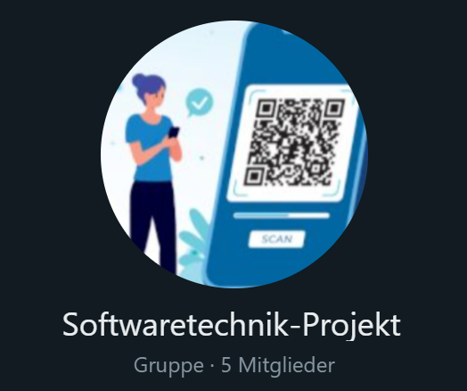
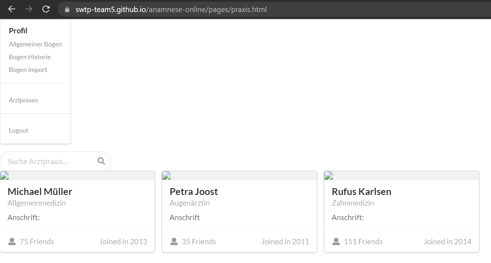

# Deliverable 1: Evaluation Tools

### Gruppe 5
* Tobias Wagner
* Jann Zimmermann
* Onur Atesavci
* Paul Drux
* Peter Förster

**Table of Content**

1. [Kommunikationstools](#1.-Kommunikationstools)  
    1.1 [WhatsApp](#1.1-WhatsApp)  
    1.2 [Microsoft Teams](#1.2-Microsoft-Teams)

2. [Tasks/Bugs/Stories](#2.-Tasks/Bugs/Stories)  
    2.1 [Microsoft Teams](#2.1-Microsoft-Teams)  
    2.2 [Miro](#2.2-Miro)  
    2.3 [GitHub Pages](#2.3-GitHub-Pages)     
    2.4 [GitHub](#2.4-GitHub)  
    2.5 [Testing](#2.5-Testing)

## 1. Kommunikationstools

### 1.1 WhatsApp
Für die schnelle Kommunikation haben wir Whatsapp verwendet und eine entsprechende Gruppe erstellt.

### 1.2 Microsoft Teams
Für Audio-Meetings und Terminplanung haben wir Microsoft Teams verwendet.

## 2. Tasks/Bugs/Stories

### 2.1 Microsoft Teams
Unseren Projektplan haben wir über Microsoft Teams verwaltet. Dafür haben wir "Tasks von Planner und To Do" genutzt, entsprechende Buckets und die dazugehörigen Aufgaben erstellt.

### 2.2 Miro
Miro haben wir für die Erstellung der Personas und User Stories verwendet.

### 2.3 GitHub Pages
Den ersten Entwurf unseres Projektes haben wir über GitHub Pages gehosted.

### 2.4 GitHub
Unser Repository und Versionierung läuft über Github.

### 2.5 Testing
Das Framework für unsere Tests ist Jest.js und die entsprechenden Tests werden in GitHub actions mit Note.js abgebildet.

